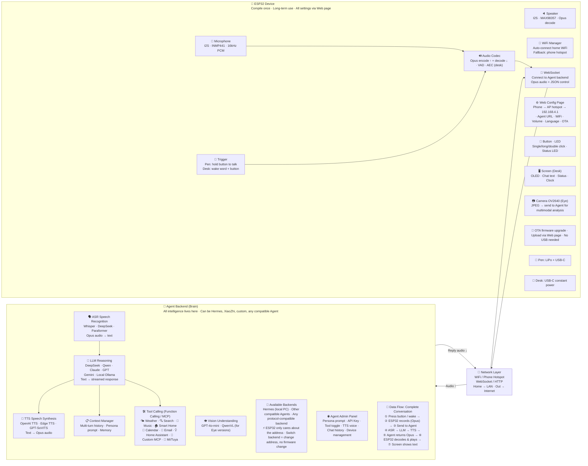

# 🖊️ XiaoXi (hermes-xiaoxi) · Product Architecture v3.0

> ESP32 Device + Agent Backend · Compile firmware once · Change Agent by editing address · 2026

---

## 🏗️ Core Architecture: ESP32 Device + Agent Backend

---

## 📦 Four Product Versions

| | 🖊️ Pen Basic (C3) | 📸 Pen Eye (CAM) | 🖥️ Desk Standard (S3) | 👁️ Desk Eye (S3 Mini) |
|---|---|---|---|---|
| **Tag** | XiaoXi Pen · C3 | XiaoXi Pen Eye · CAM | XiaoXi Desk · S3 | XiaoXi Desk Eye · S3 Mini |
| **Chip** | ESP32-C3 (5×5mm) | ESP32-CAM (S3+OV2640) | ESP32-S3 | ESP32-S3 Mini (13×20mm) |
| **Trigger** | Button (hold at pen tip) | Button (short press: talk, long: snap) | "Hello XiaoXin" + button | "Hello XiaoXin" + button |
| **Web Config** | ✅ AP hotspot | ✅ AP hotspot | ✅ AP hotspot | ✅ AP hotspot |
| **Price** | ¥99 ~ ¥149 | ¥199 ~ ¥299 | ¥199 ~ ¥249 | ¥249 ~ ¥349 |
| **HW Cost** | ~¥29 | ~¥55 | ~¥55 | ~¥63 |
| **Voice Chat** | ✅ | ✅ | ✅ | ✅ |
| **Photo/Vision** | ❌ | ✅ Snap & understand | ❌ | ✅ |
| **Screen** | ❌ | ❌ | ✅ OLED display | ✅ |
| **Wake Word** | ❌ | ❌ | ✅ + interrupt | ✅ |
| **AEC Echo Cancel** | ❌ | ❌ | ✅ | ✅ |
| **Camera** | ❌ | ✅ OV2640 | ❌ | ✅ |
| **Multimodal LLM** | ❌ | ✅ | ❌ | ✅ |
| **Home Assistant** | ❌ | ❌ | ✅ | ✅ |
| **Hotspot WiFi** | ✅ | ✅ | ✅ | ✅ |

---

## ⚡ Core Differences: XiaoZhi vs XiaoXi

| Comparison | XiaoZhi (Original) | XiaoXi (Our Solution) |
|---|---|---|
| Backend Connection | Hardcoded to official server | **Configurable address, switch freely** |
| Change Settings | Recompile firmware + reflash | **Web page edit, instant effect** |
| Switch LLM | Modify firmware | **Backend swap, ESP32 unaware** |
| Add Tools | Modify firmware | **Backend adds, ESP32 unaware** |
| Agent Capability | Depends on backend | **Connect Hermes = full Agent** |
| Offline Use | Requires Docker self-hosted server | **Just run Hermes on PC** |
| Network Setup | Requires PC client | **ESP32 built-in Web page** |
| Hardware Cost | ~¥50 | **From ~¥29** |

---

🖊️ **XiaoXi** hermes-xiaoxi · ESP32 Device + Agent Backend · Open Source Hardware + Firmware · MIT License · 2026

